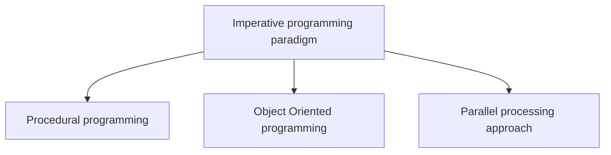
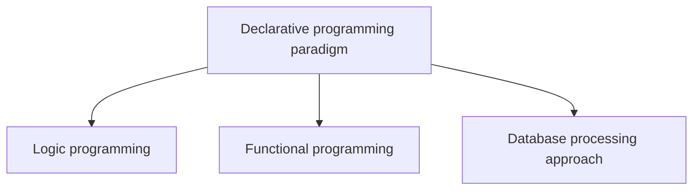
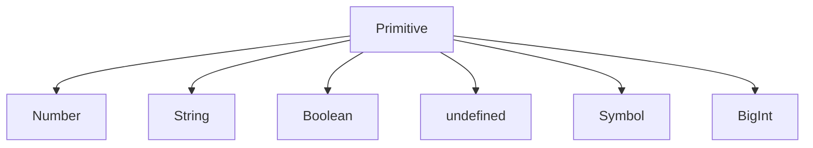
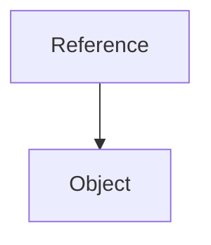

# 1-dars

Dasturlash tillari. JavaScript dasturlash tili. Primitive tiplar.

---
hideInToc: true
---

# Reja

<Toc />

---
layout: image-right
image: https://cdn.pixabay.com/photo/2014/06/13/00/16/figure-367946_960_720.png
class: bg-contain
---

# Dasturlash tili

### Til nima?

Til bu fikr almashish uchun foydalaniladigan muloqot usuli. Agar siz kimgadur biror narsani o'rgatmoqchi yoki tushuntirmoqchi bo'lsangiz o'sha kishining tilini bilishingiz kerak.

<v-click>

### Dasturlash tili nima?

Dasturlash tili bu dasturchilar tomonidan kompyuter bilan muloqot qilish uchun foydalaniladigan til. 
Bu muayyan vazifani bajarish uchun har qanday aniq tilda (C, C++, Java, Python, JavaScript) yozilgan ko'rsatmalar to'plamidir.

</v-click>

---

# Dasturlash tillarining turlari

<v-clicks>

- Quyi darajali dasturlash tillari
  
  Quyi darajali dasturlash tilida yozilgan kod mashina kodiga juda yaqin bo'ladi, va tushunishga qiyinroq bo'ladi, ammo bu tilda yozilgan dasturlar tez ishlaydi va xotiradan kamroq joy oladi.
  Quyi darajadagi dasturlash tiliga Assembler tilini misol qilishimiz mumkin.

- Yuqori darajali dasturlash tillari

  Yuqori darajali dasturlash tillari dasturchi tomonidan tushunish, yozish va o'zgaritirshga oson bo'lgan dasturlash tillari. Bu dasturlash tillarida yozilgan kodlarni mashina tushunishi uchun kompilyator yoki interpretator kerak bo'ladi.
  Yuqori darajali dasturlash tillariga Python, Java, JavaScript, PHP kabi tillarni misol qilishimiz mumkin.

- O'rta darajali dasturlash tillari

  O'rta darajali dasturlash tillari yuqori va quyi darajadagi tillarning o'rtasida joylashgan bo'ladi. Bu dasturlash tillarining afzalliklari yuqori darajadagi dasturlash tillari kabi ba'zi qulayliklarga egaligi hamda mashina tiliga yaqinroq ekanligi hisoblanadi. C va C++ tillarini misol qilishimiz mumkin.

</v-clicks>

---
class: space-y-8
---

# Dasturlash paradigmalari.






---

# Statik va dinamik tipli dasturlash tillari

<v-clicks>

- Dasturlash tili statik yoki dinamik tipli bo'lishi mumkin.

- Dinamik til (JavaScript, Python, PHP) dasturchi samaradorligini optimallashtirish uchun yaratilgan, shuning uchun siz kamroq kod bilan funksionallikni qisqa vaqt ichida amalga oshirishingiz mumkin.

- Statik til (C, C++, va hokazo) siz yozgan kod imkon qadar tezroq bajarilishi uchun mashina samaradorligini optimallashtirish uchun mo'ljallangan. Bu tillarda kod yozish dinamik tildagiga nisbatan sekinroq va ozgina qiyinroq bo'ladi.

</v-clicks>

---

# Strong vs Weakly typed

- Agar dasturlash tilida qiymatlarning tiplari qat'iy tekshirilsa bu til **strong typed** deyiladi.

- Agar dasturlash tilida bir turdagi qiymatni boshqa bir turdagi qiymat bilan konvertatsiya qilmasdan ishlatishning imkoni bo'lsa bu til **weakly typed** deyiladi.

```js
2 + '2'
```

__Strong typed__ tillarda bu ifoda xatolik beradi, chunki 2 xil tipdagi qiymatlarni bir biriga qo'shib bo'lmaydi. 
__Weakly typed__ tilda esa bu ifoda to'g'ri hisoblanadi va hech qanday xatolik bermaydi.

Strong typed tillarga Java, Python, C++ kabi tillarni misol qilishimiz mumkin.

Weakly typed tillarga JavaScript, PHP tillarini misol qilishimiz mumkin.

---

# JavaScript dasturlash tili

- JavaScript yuqori darajali, dinamik va weakly typed dasturlash tili
- 1995 yilda **Brendan Eich** tomonidan ishlab chiqilgan

<SNote class="mt-4">
  JavaScript va Java bir-biriga bog'liq bo'lmagan tillar hisoblanadi.
</SNote>


---
layout: center
---
# JavaScriptni ishga tushirish usullari

---

# Browser'da ishlatish. HTML faylda script tegi orqali

```js
<html>
  <head></head>
  <body>
    <script>
      console.log('Hello, World!);
    </script>
  </body>
</html>
```

---

# NodeJS orqali ishlatish

Hozirgi kunda JavaScriptni browser bo'lmasa ham NodeJS orqali ishlatishimiz mumkin.

```js
console.log('Hello World!');
```

```js
node index.js
```

---

# Browser console'ida JavaScript kodni ishga tushirish


---
---
# O'zgaruvchilar

<div class="grid grid-cols-2">
<div>

JavaScript-da o'zgaruvchilar qayta foydalanish mumkin bo'lgan ma'lumotlarni saqlaydigan konteynerlardir.

- O'zgaruvchida saqlangan ma'lumot dastur bajarilishi davomida o'zgartirilishi mumkin.
- O'zgaruvchi faqat xotira joyiga berilgan nom bo'lib, o'zgaruvchi ustida bajariladigan barcha operatsiyalar xotira joylashuviga ta'sir qiladi.
- JavaScript-da barcha o'zgaruvchilar ularni ishlatishdan oldin e'lon qilinishi kerak.

</div>

</div>

---
---

# O'zgaruvchilarni e'lon qilish. O'zlashtirish operatori

O'zgaruvchilarni e'lon qilish

JavaScriptda o'zgaruvchilar **let** kalit so'zi orqali e'lon qilinadi.

```js
let age;

age = 25;
```

<v-click>

O'zgaruvchilarni e'lon qilish davomida ham qiymat berish mumkin

```js
let age = 25;
```

</v-click>

<SNote v-click>

  **=** belgisi taqqoslash yoki tenglik degani emas, balki o'zlashtirish operatori hisoblanadi.
  
  ```js
  let age = 25; // age o'zgaruvchisi joylashgan xotiraga 25 qiymatini yozib qo'yadi.
  ```

</SNote>


---
---

# O'zgaruvchilarning turlari

JavaScript dasturlash tilida o'zgaruvchilarning 7 xil turi mavjud.

O'zgaruvchilar 2 xil toifaga bo'linadi, primitive va reference.

<div class="grid grid-cols-2">

<div>



</div>

<div v-click class="flex justify-center">



</div>
</div>


---
---

# Number tipi

```js
let a = 123;

a = 3.14;
```

Number tipi butun va haqiqiy sonlarni o'z ichiga oladi.

Sonlarni o'nglik, ikkilik, sakkizlik va o'n oltilik sanoq tizimlarida saqlash mumkin.

```js
let decimal = 156;
let binary = 0b10011100;
let octal = 0234;
let hex = 0x9c;
```

Uzun sonlarni pastki chiziq bilan ajratib yozish mumkin.

```js
let sum = 123_456_789_000;
```

---
---

# Sonlar ustida amallar

```js
let a = 10, b = 3;

let sum = a + b;           // a ga b ni qo'shish

let diff = a - b;         // a dan b ni ayitish

let mult = a * b;        // a ni b ga ko'paytirish

let div = a / b;        // a ni b ga bo'lish

let reminder = a % b;  // a ni b ga bo'lgandagi qoldiqni topish

let inc = a ++;       // a ning qiymatini birga oshirish

let dec = b --;      //  b ning qiymatini birga kamaytirish
```

---
---

# Ba'zi amallarning qisqa ko'rinishi

```js
let a = 10, b = 5;

a = a + b; => a += b;

a = a - b; => a -= b;

a = a * b; => a *= b;

a = a % b; => a %= b;

a = a / b; => a /= b;
```

---
---

# Maxsus qiymatlar

Odatiy sonlardan tashqari Number tipiga tegishli maxsus qiymatlar ham mavjud.

- Infinity
- -Infinity
- NaN (**N**ot **a** **N**umber)

```js
let musbatCheksizlik = 1 / 0;

let manfiyCheksizlik = -1 / 0;

let nan = 0 / 0;
```

---
---

# Math kutubxonasi

<STable :columns="columns" :data="data" row-key="id" />

[Batafsil bu yerda barcha funksiyalarni ko'rishingiz mumkin](https://developer.mozilla.org/en-US/docs/Web/JavaScript/Reference/Global_Objects/Math)

<script setup>
  const columns = [
    {
      title: 'Matematik funksiya nomi',
      field: 'function'
    },
    {
      title: "Ta'rif",
      field: 'description'
    }
  ];

  const data = [
    {
      id: 1,
      function: 'Math.abs(a)',
      description: 'a parametrning absalut (modul) qiymatini qaytaradi'
    },
    {
      id: 2,
      function: 'Math.cos(a)',
      description: 'a parametrning kosinus qiymatini qaytaradi'
    },
    {
      id: 3,
      function: 'Math.sin(a)',
      description: 'a parametrning sinus qiymatini qaytaradi'
    },
    {
      id: 4,
      function: 'Math.tan(a)',
      description: 'a parametrning tangenes qiymatini qaytaradi'
    },
    {
      id:5,
      function: 'Math.max(a, b, c, ...)',
      description: 'Bir nechta sonlar orasidan maksimumini qaytaradi.'
    },
    {
      id:6,
      function: 'Math.min(a, b, c, ...)',
      description: 'Bir nechta sonlar orasidan minimumini qaytaradi.'
    },
    {
      id: 7,
      function: 'Math.sqrt(a)',
      description: 'a parametrning kvadrat ildizini qaytaradi'
    },
    {
      id: 8,
      function: 'Math.pow(a, b)',
      description: 'a parametrni b darajaga oshiradi va qiymatini qaytaradi'
    },
  ]
</script>


---
---

# BigInt tipi

BigInt

JavaScriptda Number tipi (2<sup>53</sup>-1) va -(2<sup>53</sup>-1) oralig'idagi butun sonlarni qabul qiladi.
Ko'p hollarda shuni o'zi bizga yetarli bo'ladi, ammo ba'zida bizga bundan ham katta sonlar kerak bo'lib qolishi mumkin.

Shu sababli JavaScript tiliga yaqinda BigInt tipi qo'shildi.

Biror sonni **BigInt** tipida ifodalash uchun qiymatning oxiriga **n** harfini qo'shish kerak.

```js
let bigInt = 1234567890123456789012345678901234567890n;
```