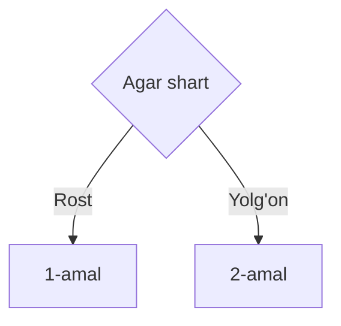

# 3-dars. 

Shart va ternar operatorlari

---
hideInToc: true
---

# Reja

<Toc :columns="2" />


---
---

# if operatori

Ba'zan biz turli xil sharoitlarda turli xil amallarni bajarishimizga to'g'ri keladi, ya'ni biror bir vaziyatdan kelib chiqib qaror qabul qilishimiz kerak bo'ladi. 
Mana shunday holatlarda biz if operatoridan foydalanishimiz mumkin.



---
layout: image
image: /assets/if-else.png
---

---
layout: center
---


---
---

# if operatori qo'llanishi

if operatori qavs ichidagi mantiqiy ifodani tekshiradi, agar u rost bo'lsa birinchi blokdagi kodni ishga tushiradi, aks holda esa else kalit so'zidan keyin kelgan blok ichidagi kodni ishga tushiradi.
Else qismini tashlab ketish mumkin, ya'ni ixtiyoriy.

<div class="grid grid-cols-2 gap-x-4">

```js
if(condition) {

}
```

```js
if(condition) {

} else {

}
```

</div>

if operatoriga Boolean tipidagi o'zgaruvchilarni, yoki Boolean tipidagi qiymatni qaytaruvchi mantiqiy mulohazalarni berish mumkin.

<div class="grid grid-cols-2 gap-x-4">

```js
let sunny = true;

if(sunny) {
  console.log("Let's go to the beach!");
}
```

```js
let number = 10;

if(number % 2 === 0) {
  console.log('Bu juft son!');
} else {
  console.log('Bu toq son!);
}
```

</div>


---
---

# if else if

Bir vaqtning o'zida bir nechta shartlarni tekshirish uchun if else if dan foydalanish mumkin.

if dan keyin xohlaganingizcha else if yozishingiz mumkin.

```js
let day = 1;

if(day === 1) {
  console.log('Dushanba');
} else if(day === 2) {
  console.log('Seshanba');
} else if(day === 3) {
  console.log('Chorshanba');
} else if(day === 4) {
  console.log('Payshanba');
} else if(day === 5) {
  console.log('Juma');
} else if(day === 6) {
  console.log('Shanba');
} else if(day === 7) {
  console.log('Yakshanba');
} else {
  console.log("Mavjud bo'lmagan hafta kuni")
}

```

---
layout: two-cols
---

# ternary operatori

Ternar operatori shart operatorini sodda ko'rinishga keltirilgan ko'rinishi va u qiymat qaytaradi. 
U `?` va  `:` belgilari yordamida amalga oshiriladi. 

```js

let value = condition ? value1 : value2;
```

<SNote>
if operatorida else qismi ixtiyoriy, ammo ternar operatorida ikkinchi qismini berish majburiy, chunki ternar operatori qiymat qaytarishi kerak.
</SNote>

::right::

<div class="flex items-center h-full">
  
</div>

---
---

# ternary operatoriga misollar

```js

let number = 21;

console.log(number % 2 === 0 ? "Juft" : "Toq");

let age = 16;

let message = age > 18 ? "Kirishga ruxsat!" : "Kirish faqat 18 yoshdan oshganlar uchun!";

console.log(message);
```

---
---

# if vs ternary

Qachon **if** operatorini va qachon **ternar** operatorini ishlatish kerak?

**Ternary**

- Soddaroq amallar uchun
- Natijadan biror qiymat olish uchun

**if**

- Bir qatorga sig'maydigan murakkabroq amallar uchun

ishlatish kerak.

---
---

# Misol yechishga namunalar

<SQuestion>

**if1.** Butun son berilgan. Agar, berilgan son musbat bo'lsa, 1 ga oshirilsin, aks holda 
o'zgartirilmasin. Hosil bo'lgan sonni ekranga chiqaruvchi programma tuzilsin. 

</SQuestion>

if operatori yordamida ishlash

```js
function if1(n) {
  if(n > 0) {
    return n + 1;
  } else {
    return n;
  }
};
```

ternar operatori bilan ishlash

```js
function if1(n) {
  return n > 0 ? (n + 1) : n;
};
```

---
---

# Misol yechishga namunalar