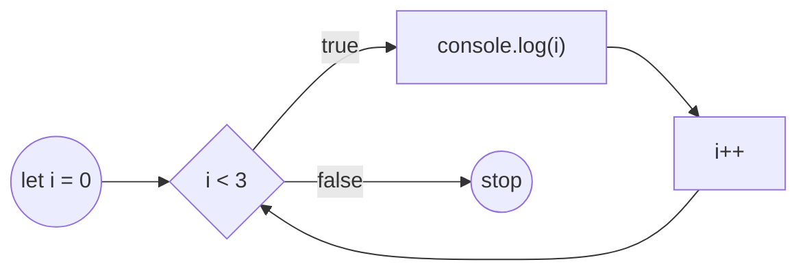

# Sikllar. For sikli

Takrorlanishlar

---
hideInToc: true
---

# Reja

<Toc />

---
layout: image-right
image: /assets/loop.gif
---

# JavaScriptda sikllar

Biz ko'pincha amallarni takrorlashimiz kerak bo'ladi. Masalan mahsulotlar ro'yxatini ketma-ket ekranda ko'rsatish yoki 1 dan 10 gacha bo'lgan sonlar ustida biror amal bajarish.

Sikllar orqali biz ma'lum bir kodni bir necha marta ishga tushirishimiz, ya'ni takrorlashimiz mumkin.

JavaScript dasturlash tilida 3 xil sikl operatorlari mavjud:

- for
- do
- do while

---
---

# for sikli

Har bir sikl operatori biz yechmoqchi bo'lgan muammoning holatiga qarab ishlatiladi.

For siklidan takrorlanishlar soni aniq bo'lgan holatlarda ishlatish tavsiya etiladi.

```js
for(begin; condition; step) {
  // sikl tanasi
}
```

Quyidagi kod konsolga 0, 1 va 2 raqamlarini chiqaradi.

```js
for (let i = 0; i < 3; i++) {
  console.log(i);
}
```

---
---

# for siklining tuzilishi

<STable :show-numeration="false" :columns="columns" :data="data" row-key="id" />

<script setup>
  const columns = [
    { title: 'Qism', field: 'part' },
    { title: '', field: 'code' },
    { title: '', field: 'description' },
  ];

  const data = [
    { id: 1, part: 'begin', code: 'let i = 0', description: 'Sikl ishga tushganda bir marta ishlaydi.' },
    { 
      id: 2, 
      part: 'condition', 
      code: 'i < 3', 
      description: "Siklning har bir iteratsiyasida ishga tushadi, agar false bo'lsa sikl to'xtaydi" 
    },
    { 
      id: 3, 
      part: 'body', 
      code: 'console.log(i)', 
      description: "Siklning har bir iteratsiyasida ishlaydi toki condition false bo'lgunga qadar"
    },
    { 
      id: 4, 
      part: 'step', 
      code: 'i++', 
      description: 'body dan keyin har bir iteratsiyada ishlaydi.' 
    },
  ]
</script>


---
---



<SNote>

for sikli ichida `let` orqali e'lon qilingan o'zgaruvchi faqat shu sikl ichida mavjud bo'ladi va sikl tugagandan so'ng xotiradan o'chiriladi.

</SNote>

for sikli ichida avvaldan mavjud bo'lgan o'zgaruvchilarni ham ishlatish mumkin.

```js
let i = 1;

for(i = 1; i < 100; i++) {
  console.log(i);
}
```

---
---

# Qismlarni tushirib qoldirish

For siklidagi 3 ta qismdan xohlaganini, yoki hammasini tushirib qoldirish mumkin.

```js
let i = 0;

for(; i < 3; i++) {
  console.log(i);
}
```

```js
let i = 0;
for(; i < 3;) {
  console.log(i++);
}
```

Cheksiz sikl yaratish. 

```js
for(;;) {
  console.log('Bu cheksiz ishlab turadi.');
}
```

---
---

# Siklni muddatidan oldin to'xtatish. Break

Normal holatda sikl qachon biz bergan shart false qiymat qaytarganda to'xtaydi.
Ammo biz **break** orqali siklni to'xtashga majbur qilishimiz mumkin.

```js
for(let i = 0; i < 100; i++) {
  console.log(i);
  if(i % 20 === 0) {
    break;
  }
}
```

---
---

# Siklda qadamlarni o'tkazib yuborish. Continue

**continue** orqali biz sikl bir qadam oldinga o'tkazib yuborishimiz mumkin

Quyidagi kodda console ga 1, 3, 5, 7 va 9 raqamlari chiqariladi.

```js
for(let i = 0; i < 10; i++) {
  if(i % 2 === 0) {
    continue;
  }

  console.log(i);
};
```