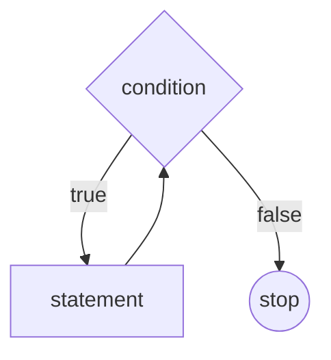

# Sikllar. while sikli


---
hideInToc: true
---

# Reja

<Toc />

---
---

# while sikli

Takrorlanishlar soni aniq bo'lmagan holatlarda while siklini ishlatish tavsiya etiladi.
While sikli quyidagi ko'rinishda yoziladi:

```js
while(condition) {
  // code
}
```
Quyidagi kod 0 dan 2 gacha bo'lgan sonlarni konsolga chiqaradi.

```js
let i = 0;
while (i < 3) {
  console.log( i );
  i++;
}
```

---
---

# while sikli



---
---

# while sikliga misol

```js
let sum = 0;
let i = 0;

while(i <= 10) {
  sum += i;
  i++;
}

console.log(sum);
```

---
---

# Cheksiz sikl

while siklida shartga true qiymati berilsa sikl cheksiz davom etadi.

```js
while(true) {
  console.log('Cheksiz sikl');
}
```

---
layout: center
---

# do while

---
layout: center
---

<div class="flex items-center justify-center">
  
</div>

---
---

# do while sikli ishlash prinsipi

do while siklida tekshiriladigan shart siklning tana qismidan pastda yoziladi.

- do while siklida birinchi kod ishga tushib keyin shart tekshiriladi. 

- Shuning uchun do while sikli kamida 1 marta ishga tushadi.

```js
let sum = 0;
let i = 0;

do {
  sum += i;
  i++;
} while(i < 10);

console.log(sum);
```

---
layout: image-right
image: https://images.unsplash.com/photo-1601597111158-2fceff292cdc?ixlib=rb-1.2.1&ixid=MnwxMjA3fDB8MHxwaG90by1wYWdlfHx8fGVufDB8fHx8&auto=format&fit=crop&w=1170&q=80
---

# do while hayotiy misol

Tasavvur qiling siz bankomatdan naqd pul yechmoqchisiz. 
Bu holatda siz birinchi plastik kartangiz PIN kodini kiritishingiz kerak.

Agar siz PIN kodni noto'g'ri kiritsangiz, qaytadan kiritishingiz kerak bo'ladi va hammasi boshidan boshlanadi.

```js
do {

  // PIN kodni kiritish
  // Naqd pul yechish
  
} while(pinKodXatoEmas)
```